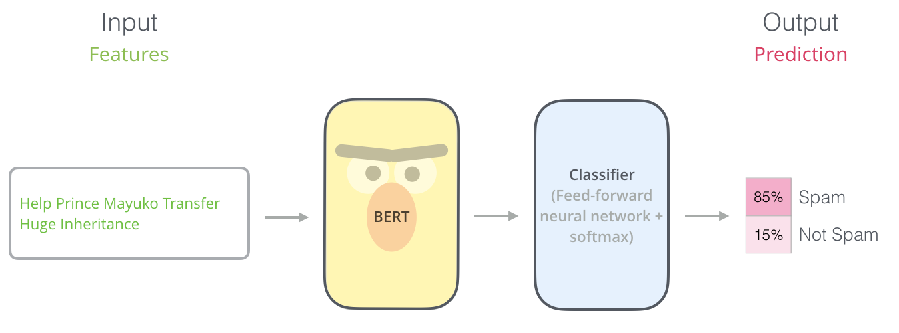

# Spam Detection and Sentiment Analysis using ELMo and BERT

## Introduction
This exercise was completed in preparation for the Natural Language Processing (NLP) course at [Tehran University](https://ut.ac.ir/en) in 2020.

In this exercise, we are going to use contextual embedding method with pre-trained ELMo and Bert models for Spam Detection and Sentiment Analysis. We intends to use these pre-trained models for our tasks.

The image below shows how we can use BERT for Spam Detection task.

### Dataset

In this exercise, we have two datasets that are in data folder. The spam.xlsx file is for using in Spam Detection task. The aclImdb dataset is for Sentiment Analysis task and including movie reviews.

---

The report of the work have done is [here](CA5_report.pdf).

[Spam Detection with BERT - notebook](CA5-Spam-Bert.ipynb)  
[Spam Detection with ELMo - notebook](CA5-Spam-Elmo.ipynb)  
[Sentiment Analysis with BERT - notebook](CA5-Imdb-Bert.ipynb)  
[Sentiment Analysis with ELMo - notebook](CA5-Imdb-Elmo.ipynb)  

